在训练不同机器学习算法模型时，遇到的各类训练算法大多对用户都是一个黑匣子，而理解它们实际怎么工作，对用户是很有帮助的；

- 快速定位到合适的模型与正确的训练算法，找到一套适当的超参数等；
- 更高效的执行错误调试、错误分析等；
- 有助于理解、构建和训练神经网络等；

**训练方法**

- 线性回归模型
  - 闭式方程，直接计算出最拟合训练集的模型参数（使训练集上的成本函数最小化的模型参数）；
  - 迭代优化（GD、梯度下降、梯度下降变体、小批量梯度下降、随机梯度下降），逐渐调整模型参数直至训练集上的成本函数调至最低；
- 多项式回归模型
  - 学习曲线评估过拟合情况
  - 正则化技巧（降低过拟合风险）
- 分类模型
  - Logistic 回归
  - Softmax 回归

## 1. 线性回归

线性模型可以当做是对输入特征做加权求和，再加上一个偏置项（截距项）常数；

**`线性回归模型预测`**

$$
    \hat{y} = \theta_0 + \theta_1x_1 + \theta_2x_2 + ... + \theta_nx_n
$$

- $\hat{y}$，预测值；
- `n`，特征数量；
- $x_i$，第 i 个特征值；
- $\theta_j$，第 j 个模型参数（包括偏差项 $\theta_0$ 和特征权重 $\theta_1$、$\theta_2$、...、$\theta_n$）；

**`线性回归模型预测（向量化形式）`**

$$
    \hat{y} = h_\theta(x) = \theta · x
$$

- $\theta$，模型的参数向量，其中包含偏差项 $\theta_0$ 和特征权重 $\theta_1$ 至 $\theta_n$
- `x`，实例的特征向量，包含从 $x_0$ 到 $x_n$, $x_0$ 始终等于 1；
- $\theta · x$，向量 $\theta$ 和 X 的点积，它相当于 $\theta_0x_0 + \theta_1x_1 + \theta_2x_2 + ... + \theta_nx_n$；
- $h_\theta$，假设函数，使用模型参数 $\theta$；

`特征向量`（`feature vector`），一个样本对应在样本空间中坐标轴上的坐标向量；
`向量`，在机器学习中通常表示列向量，表示单一列的二维数组；

**线性回归模型的 MSE 成本函数**

$$
    MSE = (X, h_\theta) = \frac{1}{m}\sum_{i=1}^m(\theta^Tx^{(i)} - y^{(i)})^2
$$

- $h_\theta$，其中的 $\theta$ 表示模型 h 是被向量 $\theta$ 参数化的；

### 1. 标准方程

- `闭式解方法`，直接得出使成本函数最小的 $\theta$ 值的数据方程，也称标准方程；

$$
    \hat{\theta} = (X^TX)^{-1}X^Ty
$$

- $\hat{\theta}$，使成本函数最小的 $\theta$ 值；
- y，包含 $y^{(1)}$ 到 $y^{(m)}$ 的目标值向量；

**使用线性数据测试标准方程**

```python
import numpy as np

X = 2 * np.random.rand(100, 1)
y = 4 + 3 * X + np.random.randn(100, 1)

plt.plot(X, y, "b.")
plt.xlabel("$x_1$", fontsize=18)
plt.ylabel("$y$", rotation=0, fontsize=18)
plt.axis([0, 2, 0, 15])
plt.show()
```

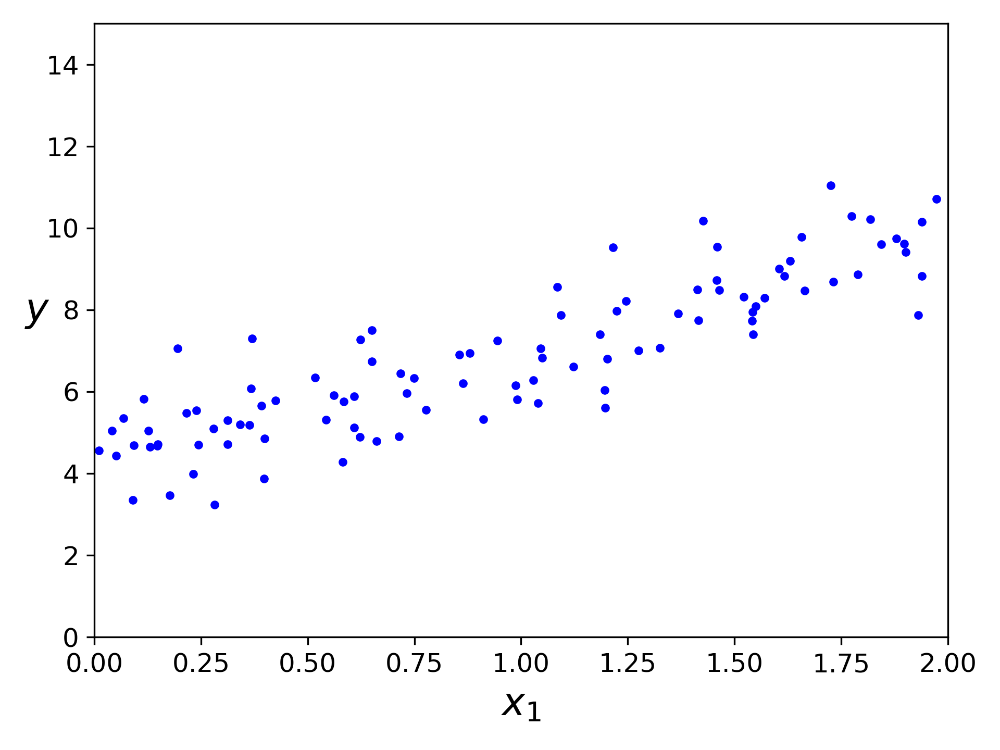<p class="caption">generated data plot</p>

**使用标准方程计算 $\hat{\theta}$**

- `inv()`，对矩阵求逆；
- `dot()`，计算矩阵的内积；

```python
>>> X_b = np.c_[np.ones((100, 1)), X]  # add x0 = 1 to each instance
>>> theta_best = np.linalg.inv(X_b.T.dot(X_b)).dot(X_b.T).dot(y)
>>>
array([[4.21509616],
       [2.77011339]])
```

原本的 $\theta_0$=4，$\theta_1$=3，这里算出的 $\theta_0$=4.215，$\theta_1$=2.770，已经比较接近；

**使用 $\hat{\theta}$ 做预测**

```python
>>> X_new = np.array([[0], [2]])
>>> X_new_b = np.c_[np.ones((2, 1)), X_new] # add x0 = 1 to each instance
>>> y_predict = X_new_b.dot(theta_best)
>>> y_predict
array([[4.21509616],
       [9.75532293]])
```

**绘制模型的预测结果**

```python
plt.plot(X_new, y_predict, "r-", linewidth=2, label="Predictions")
plt.plot(X, y, "b.")
plt.xlabel("$x_1$", fontsize=18)
plt.ylabel("$y$", rotation=0, fontsize=18)
plt.legend(loc="upper left", fontsize=14)
plt.axis([0, 2, 0, 15])
plt.show()
```

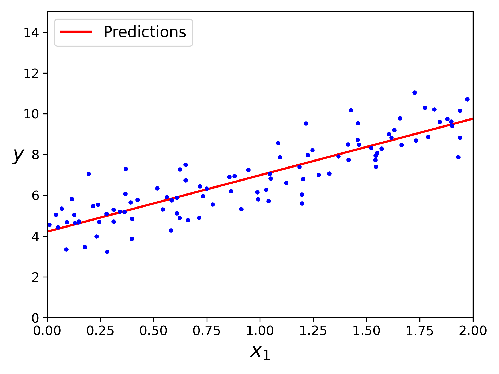<p class="caption">linear model predictions plot</p>

### 2. 奇异值分解

**回顾使用 Scikit-Learn 的 LinearRegression**

```python
>>> from sklearn.linear_model import LinearRegression
>>> lin_reg = LinearRegression()
>>> lin_reg.fit(X, y)
>>> lin_reg.intercept_, lin_reg.coef_
(array([4.21509616]), array([[2.77011339]]))
>>> lin_reg.predict(X_new)
array([[4.21509616],
       [9.75532293]])
```

- `intercept_`，偏差项；
- `coef_`，特征权重；

LinearRegression 的 $\theta$ 是基于 scipy.linalg.lstsq() 函数（`最小二乘`）计算的；

$$
    \hat{\theta} = X^{+}y
$$

- $X^{+}$，X 的伪逆；

```python
>>> theta_best_svd, residuals, rank, s = np.linalg.lstsq(X_b, y, rcond=1e-6)
>>> theta_best_svd
array([[4.21509616],
       [2.77011339]])
```

**使用 np.linalg.pinv() 计算伪逆**

```python
>>> np.linalg.pinv(X_b).dot(y)
array([[4.21509616],
       [2.77011339]])
```

- `奇异值分解`（`Singular Value Decomposition`，`SVD`），计算伪逆的标准矩阵分解技术，可将训练集矩阵 X 分解成三个矩阵 $U\sum{}V^{T}$ 的乘积（numpy.linalg.svd() 实现）；

$$
    X^{+} = V\sum{}^{+}U^{T}
$$

- **$\sum^{+}$ 的计算方式**：取 $\sum$ 并将所有小于一个阈值的值设置成 0，再将非 0 值替换成它们的倒数，最后把结果矩阵转置；

** SVD vs. 标准方程**

伪逆比标准方程更有效，可以很好的处理边缘问题，若 $X^TX$ 是不可逆的，标准方程可能无解，而伪逆总是有定义的；

### 3. 计算复杂度

**标准方程相对特征数量 n 的计算复杂度**

$$
    O(n^{2.4}) -> O(n^{3})
$$

标准方程计算的是 $X^{T}X$ 的逆，$X^{T}X$ 是一个 $(n+1) \times (n+1)$ 的矩阵（n 是特征数），求逆的计算复杂度通常为 $O(n^{2.4})$ 至 $O(n^{3})$（具体取决于实现方式）；当 n 翻倍，计算复杂度将变大 $2^{2.4}$=5.3 至 $2^3$=8 倍；

**SVD 相对特征数量 n 的计算复杂度**

$$O(n^2)$$

相对于训练集的实例数量 $O(m)$，标准方程和 SVD 的计算复杂度都是线性的；

线性回归模型一经训练（不论标准方程还是其他算法），预测就非常快，计算复杂度相对于要预测实例数量和特征数量都是线性的；

## 2. 梯度下降

_假设你迷失在山上的浓雾之中，你能感觉到的只有你脚下路面的坡度；快速到达山脚的一个策略就是沿着最陡的方向下坡；_

- `梯度下降算法`，通过测量参数向量 $\theta$ 相关的误差函数的局部梯度，并不断沿着降低梯度的方向调整，直到梯度降为 0，达到最小值；

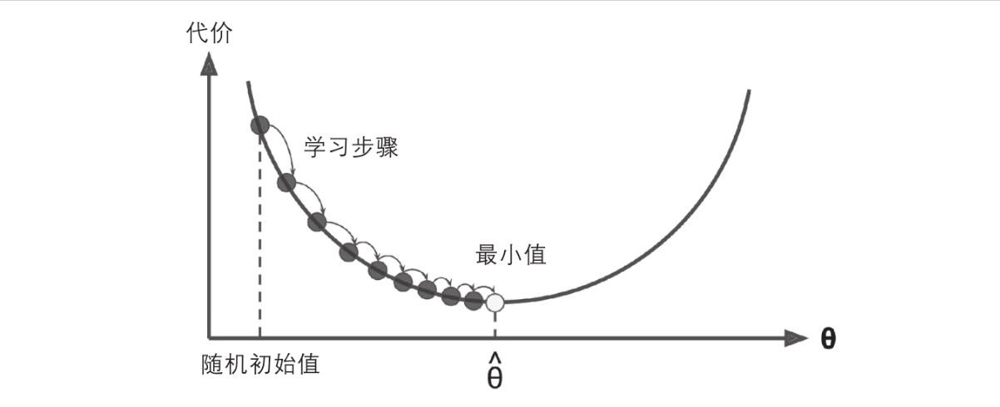<p class="caption">梯度下降过程</p>

首先随机选择一个 $\theta$ 值（随机初始化），然后逐步改进，每次踏出一步，每步参试降低一点成本函数（如 MSE），直到算法收敛为一个最小值；

- `学习率`，超参数，梯度下降每一步的步长；
  - `太低`，算法需要大量迭代才能收敛，耗时变得很长；
  - `太高`，导致算法发散，值越来越大，可能直接越过山谷到达另一边，甚至比之前的起点还高，无法找到最优解；

**梯度下降陷阱**

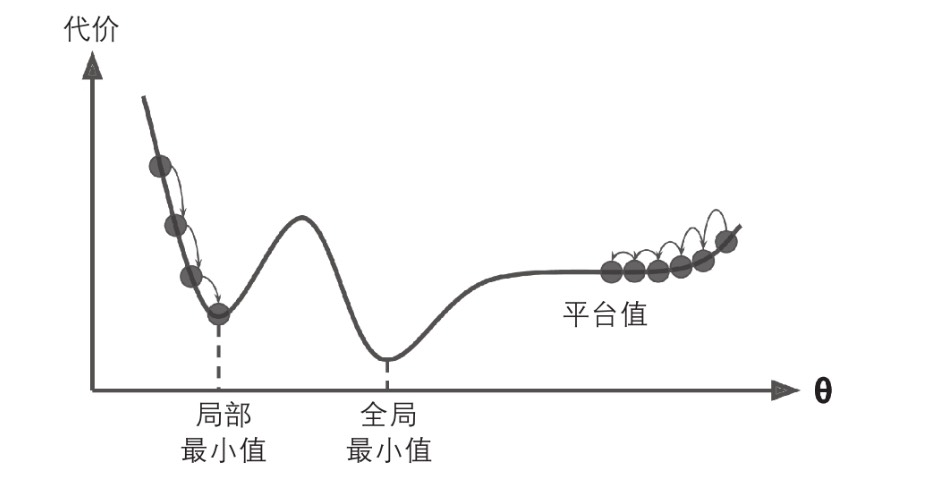<p class="caption">梯度下降陷阱</p>

并非所有的成本函数都是一个碗型的，可能如图一般不规则，导致很难收敛到全局最小值；若随机初始化起点在左侧，会收敛到一个局部最小值，而非全局最小值；若随机初始化起点在右侧，则可能需要很长一段时间才能迭代到最低点，若停下得太早，可能永远无法到底全局最小值；

线性回归模型的 MSE 成本函数是一个连续的凸函数，因此不存在局部最小值，只有一个全局最小值，且斜率不会产生陡峭变化；即使乱走梯度下降也可以趋近全局最小值；

**细长碗状成本函数**

因不同特征的尺寸差异巨大导致的细长碗状成本函数；特征值越小（如 $\theta_1$），就需要更大的变化来影响成本函数；

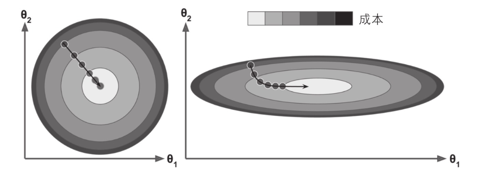<p class="caption">梯度下降成本（细长碗状）</p>

左图的梯度下降算法直接走向最小值，可以快速到达；右图则先沿着与全局最小值方向近乎垂直的方向前进，然后验证近乎平坦的山谷走到最小值，需要花费大量时间；

应用梯度下降时，需保证所有特征值大小比例相差不多（比如使用 Scikit-Learn 的 StandardScaler），否则收敛时间会长很多；

训练模型也就是搜寻使成本函数（在训练集上）最小化的参数组合；这是模型参数空间层面上的搜索，模型的参数越多，这个空间的维度就越多，搜索就越难；同样是在干草堆里寻找一根针，在一个三百维的空间里就比在一个三维空间里要棘手得多；幸运的是，线性回归模型的成本函数是凸函数，针就躺在碗底；

### 1. 批量梯度下降

实现梯度下降需要计算每个模型关于参数 $\theta_j$ 的成本函数的梯度，即计算关于参数 $\theta_j$ 的成本函数的偏导数，计作 $\frac{\partial}{\partial\theta_j}MSE(\theta)$；

**成本函数的偏导数**

$$
    \frac{\partial}{\partial\theta_j}MSE(\theta) = \frac{2}{m}\sum_{i=1}^{m}(\theta^{T}x^{(i)} - y^{(i)})x_j^{(i)}
$$

**一次性计算偏导数**

$$
    \triangledown_\theta MSE(\theta) = \begin{pmatrix}
            \frac{\partial}{\partial\theta_0}MSE(\theta) \\
            \frac{\partial}{\partial\theta_1}MSE(\theta) \\
            ... \\
            \frac{\partial}{\partial\theta_n}MSE(\theta) \\
        \end{pmatrix} \
        = \frac{2}{m} X^{T}(X\theta - y)
$$

在计算梯度下降的每一步时，都是基于完整的训练集 X 的；因此面对非常庞大的训练集时，算法会变得极慢（梯度下降算法随特征数量扩展的表现比较好，比如几十万个特征，梯度下降比标准方程或者 SVD 要快很多）；

**梯度下降步骤**

$$
    \theta^{(next)} = \theta - \eta \triangledown_\theta MSE(\theta)
$$

- $\eta$，学习率，用梯度向量乘以 $\eta$ 确定下坡步长的大小；

**梯度下降的快速实现**

```python
eta = 0.1  # learning rate
n_iterations = 1000
m = 100

theta = np.random.randn(2, 1)  # random initialization

for iteration in range(n_iterations):
    gradients = 2/m * X_b.T.dot(X_b.dot(theta) - y)
    theta = theta - eta * gradients

print(theta)
[[4.21509616]
 [2.77011339]]
```

theta 计算结果与标准方程的计算结果相同；

**计算三种学习率的梯度下降前十步**

虚线表示起点；

```python
theta_path_bgd = []

def plot_gradient_descent(theta, eta, theta_path=None):
    m = len(X_b)
    plt.plot(X, y, "b.")
    n_iterations = 1000
    for iteration in range(n_iterations):
        if iteration < 10:
            y_predict = X_new_b.dot(theta)
            style = "b-" if iteration > 0 else "r--"
            plt.plot(X_new, y_predict, style)
        gradients = 2/m * X_b.T.dot(X_b.dot(theta) - y)
        theta = theta - eta * gradients
        if theta_path is not None:
            theta_path.append(theta)
    plt.xlabel("$x_1$", fontsize=18)
    plt.axis([0, 2, 0, 15])
    plt.title(r"$\eta = {}$".format(eta), fontsize=16)

np.random.seed(42)
theta = np.random.randn(2,1)  # random initialization

plt.figure(figsize=(10,4))
plt.subplot(131); plot_gradient_descent(theta, eta=0.02)
plt.ylabel("$y$", rotation=0, fontsize=18)
plt.subplot(132); plot_gradient_descent(theta, eta=0.1, theta_path=theta_path_bgd)
plt.subplot(133); plot_gradient_descent(theta, eta=0.5)
plt.show()
```

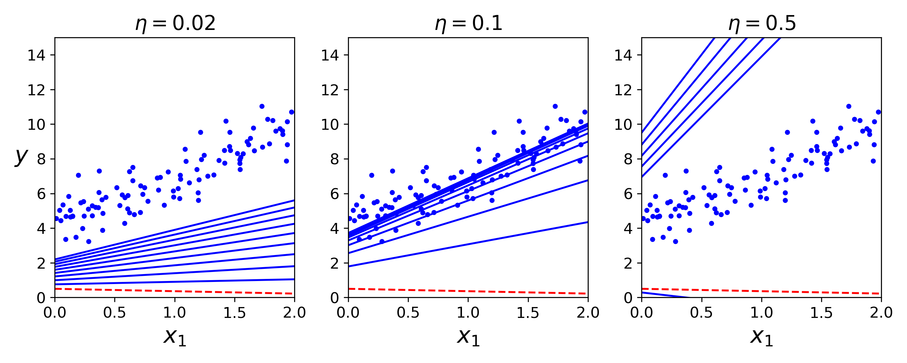<p class="caption">gradient descent plot</p>

- `左图`，学习率太低，需要太长时间找到解决方法；
- `中图`，学习率恰好，经过几次迭代收敛出了最终解；
- `右图`，学习率太高，算法发散，直接跳过了数据区域，且每次都离实际解决方案越来越远；

可以通过`网格搜索`找到合适的学习率，但需要`限制迭代次数`从而淘汰掉那些收敛耗时太长的模型；

- `限制迭代次数`的简单办法是，在开始时设置一个非常大的迭代次数，当梯度向量的值变得非常微小时中断；即当梯度向量的范数变得低于容差时，梯度下降到了几乎最小值；

- `收敛速度`，若成本函数为凸函数，且斜率没有陡峭变化（如 MSE 的成本函数），则具有固定学习率的批量梯度下降最终会收敛到最佳解；若将容差缩小到原来的 1/10 以得到更精确的解，算法将不得不运行 10 倍的时间；

### 2. 随机梯度下降

- `随机梯度下降`，与使用整个训练集计算每一步的梯度，算法特别慢的批量梯度下降相对，随机梯度下降在每一步梯度计算时，在训练集随机选择一个实例计算梯度，算法很快；可用于海量数据集的训练，每次迭代只需要在内存中运行一个实例（SGD 可以作为核外算法实现）；

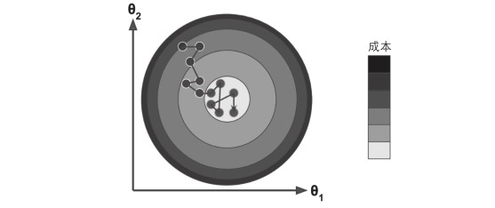<p class="caption">随机梯度下降训练过程</p>

随机梯度下降的随机性质让它比批量梯度下降要不规则得多；成本函数不再是持续下降至最下值，而是存在上下波动，但整体上会慢慢下降，最终接近最小值（即时达到最小值依旧会反弹，该算法的参数值只能是足够好，不会是最优）；

- `逃离局部最优`，成本函数非常不规则时，随机梯度下降可以跳出局部最小值，相比批量梯度下降，它更能找到全局最小值；

- `模拟退火`，逐步降低学习率，开始的步长较大，快速进展和逃离局部最小值，然后越来越小，让算法尽量靠近全局最小值；

- `学习率调度`，确认每个迭代学习率的函数；

学习率降得太快可能陷入局部最小值，学习率降得太慢可能需要太长时间走到最小值的附近，提前结束训练可能导致得到一个次优的解决方案；

**学习率调度实现随机梯度下降**

```python
theta_path_sgd = []
m = len(X_b)
np.random.seed(42)

n_epochs = 50
t0, t1 = 5, 50  # learning schedule hyperparameters


def learning_schedule(t):
    return t0 / (t + t1)


theta = np.random.randn(2, 1)  # random initialization

for epoch in range(n_epochs):
    for i in range(m):
        if epoch == 0 and i < 20:
            y_predict = X_new_b.dot(theta)
            style = "b-" if i > 0 else "r--"
            plt.plot(X_new, y_predict, style)
        random_index = np.random.randint(m)
        xi = X_b[random_index:random_index+1]
        yi = y[random_index:random_index+1]
        gradients = 2 * xi.T.dot(xi.dot(theta) - yi)
        eta = learning_schedule(epoch * m + i)
        theta = theta - eta * gradients
        theta_path_sgd.append(theta)

plt.plot(X, y, "b.")
plt.xlabel("$x_1$", fontsize=18)
plt.ylabel("$y$", rotation=0, fontsize=18)
plt.axis([0, 2, 0, 15])
plt.show()
```

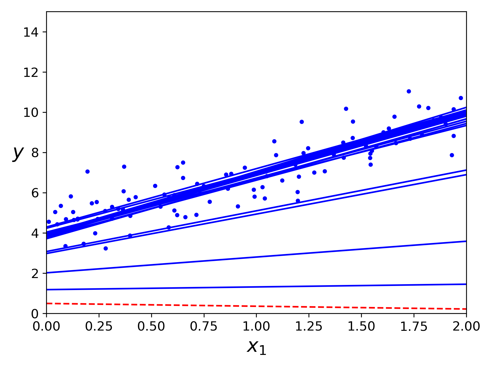<p class="caption">sgd plot</p>

随机选取事例，某些实例可能每个轮次被选中多次，有的实例则可能不会被选中；

- `IID`，`独立且均匀分布`，在训练过程中对实例进行随机混洗；使用随机梯度下降时，训练实例必须独立且均匀分布，确保平均而言将参数拉向全局最优值；

```python
>>> print(theta)
[[4.21076011]
 [2.74856079]]
```

**使用 SGDRegressor 执行线性回归**

```python
from sklearn.linear_model import SGDRegressor
sgd_reg = SGDRegressor(max_iter=1000, tol=1e-3, penalty=None, eta0=0.1)
sgd_reg.fit(X, y.ravel())

print(sgd_reg.intercept_, sgd_reg.coef_)
```

```python
[4.22520079] [2.79873691]
```

- `max_iter`，最多可运行的轮次数；
- `tol`，轮次期间损失下降小于该值将停止训练；
- `eta0`，起始学习率；

### 3. 小批量梯度下降

- `小批量梯度下降`，相比于基于完整训练集（如批量梯度下降）和基于一个实例（如随机梯度下降）来计算梯度，小批量梯度下降在小型批量的随机实例集上计算梯度；可以通过矩阵操作的硬件优化（如 GPU）来提高性能；

小批量梯度下降比随机梯度下降在参数空间上的进展更稳定，且最终更接近最小值，但可能很难摆脱局部最小值（局部最小值影响情况下不像线性回归）；而批量梯度下降最终会实际停留在最小值，只是批量梯度下降每一步需要花费很多时间；好的处理方式是使用良好的`学习率调度`让随机梯度下降和小批量梯度下降尽可能达到最小值；

**线性回归算法的比较**

| 算法      | m 很大 | 核外支持 | n 很大 | 超参数 | 要求缩放 | Scikit-Learn     |
| --------- | ------ | -------- | ------ | ------ | -------- | ---------------- |
| 标准方程  | 快     | 否       | 慢     | 0      | 否       | N/A              |
| SVD       | 快     | 否       | 慢     | 0      | 否       | LinearRegression |
| 批量 GD   | 慢     | 否       | 快     | 2      | 是       | SGDRegressor     |
| 随机 GD   | 快     | 是       | 快     | >= 2   | 是       | SGDRegressor     |
| 小批量 GD | 快     | 是       | 快     | >= 2   | 是       | SGDRegressor     |

所有这些算法最终都具有非常相似的模型，且以完全相同的方式进行预测；

## 3. 多项式回归

- `多项式回归`，使用线性模型来拟合非线性模型；比如将每个特征的幂次方添加为一个新特征，然后在此扩展特征集上训练一个线性模型；

**多项式回归示例：$y=ax^2+bx+c$**

在二次方程 $y=ax^2+bx+c$ 的基础上添加一些噪声；

```python
np.random.seed(42)

m = 100
X = 6 * np.random.rand(m, 1) - 3
y = 0.5 * X**2 + X + 2 + np.random.randn(m, 1)

plt.plot(X, y, "b.")
plt.xlabel("$x_1$", fontsize=18)
plt.ylabel("$y$", rotation=0, fontsize=18)
plt.axis([-3, 3, 0, 10])
plt.show()
```

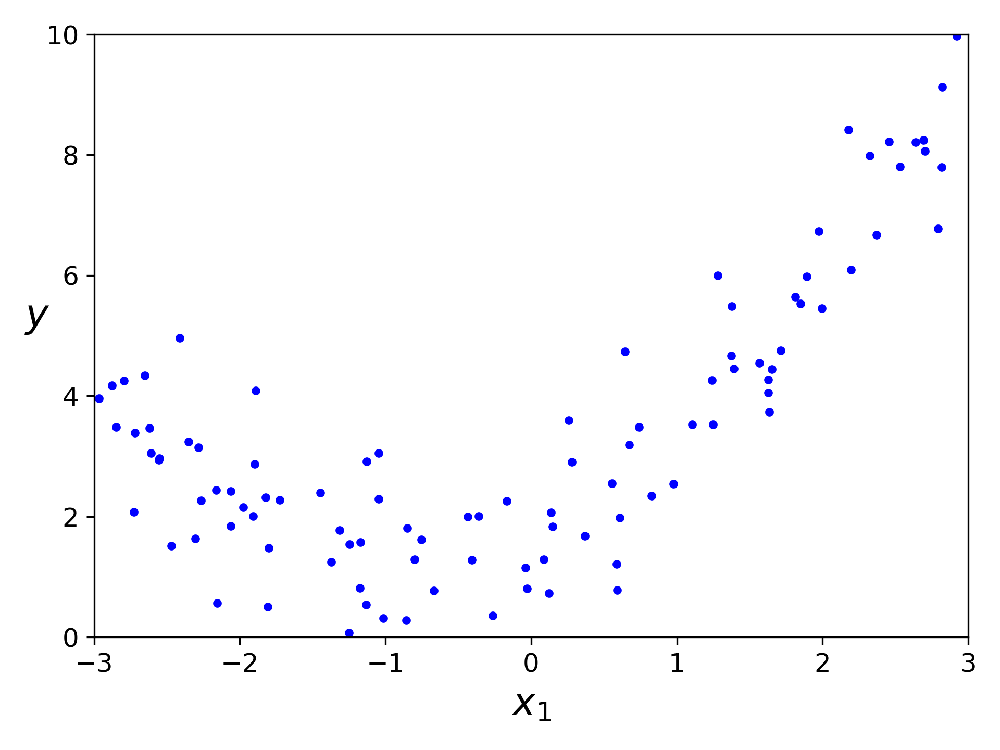<p class="caption">quadratic data plot</p>

**使用 PolynomialFeatures 类转换训练数据**

将训练集中每个特征的评分（二次多项式）添加为新特征；

```python
>>> from sklearn.preprocessing import PolynomialFeatures
>>> poly_features = PolynomialFeatures(degree=2, include_bias=False)
>>> X_poly = poly_features.fit_transform(X)
>>> X[0]
array([-0.75275929])

>>> X_poly[0]   # 包含 X 的原始特征以及该特征的平方
array([-0.75275929,  0.56664654])
```

将 LinearRegression 模型拟合到该扩展训练数据中；

```python
>>> lin_reg = LinearRegression()
>>> lin_reg.fit(X_poly, y)
>>> lin_reg.intercept_, lin_reg.coef_
(array([1.78134581]), array([[0.93366893, 0.56456263]]))
```

即模型估算：$\hat{y} = 0.56x_1^2 + 0.93x_1 + 1.78$（与原始函数相符：$y=0.5x_1^2 + 1.0x_1 + 2.0 + Gaussian Noise$ ）

**多项式回归曲线**

```python
X_new = np.linspace(-3, 3, 100).reshape(100, 1)
X_new_poly = poly_features.transform(X_new)
y_new = lin_reg.predict(X_new_poly)
plt.plot(X, y, "b.")
plt.plot(X_new, y_new, "r-", linewidth=2, label="Predictions")
plt.xlabel("$x_1$", fontsize=18)
plt.ylabel("$y$", rotation=0, fontsize=18)
plt.legend(loc="upper left", fontsize=14)
plt.axis([-3, 3, 0, 10])
plt.show()
```

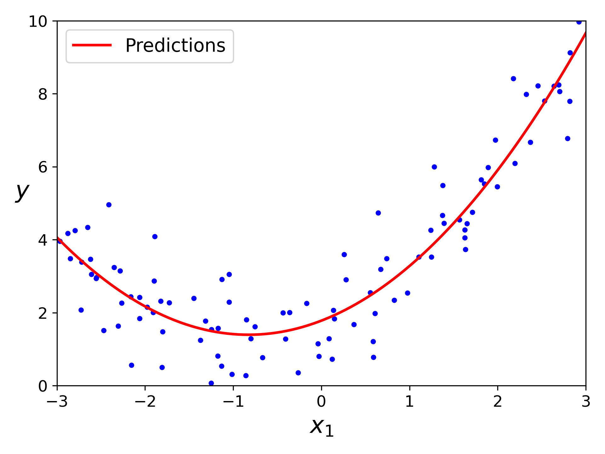<p class="caption">quadratic predictions plot</p>

存在多个特征时，多项式回归能够找到特征之间的关系；PolynomialFeatures 可以将特征的所有组合添加到给定的多项式阶数（如存在两个特征 a 和 b，degress=3 的 PolynomialFeatures 不仅会添加特征 $a^2, a^3, b^2, b^3$，还会添加组合 $ab, a^2b, ab^2$）；

PolynomialFeatures（degree=d）可以将一个包含 n 个特征的数组转换为包含 $\frac{(n+d)!}{d!n!}$ 个特征的数组；因此要小心特征组合的数量爆炸；

## 4. 学习曲线

**高阶多项式回归的拟合曲线**

```python
from sklearn.preprocessing import StandardScaler
from sklearn.pipeline import Pipeline

for style, width, degree in (("g-", 1, 300), ("b--", 2, 2), ("r-+", 2, 1)):
    polybig_features = PolynomialFeatures(degree=degree, include_bias=False)
    std_scaler = StandardScaler()
    lin_reg = LinearRegression()
    polynomial_regression = Pipeline([
        ("poly_features", polybig_features),
        ("std_scaler", std_scaler),
        ("lin_reg", lin_reg),
    ])
    polynomial_regression.fit(X, y)
    y_newbig = polynomial_regression.predict(X_new)
    plt.plot(X_new, y_newbig, style, label=str(degree), linewidth=width)

plt.plot(X, y, "b.", linewidth=3)
plt.legend(loc="upper left")
plt.xlabel("$x_1$", fontsize=18)
plt.ylabel("$y$", rotation=0, fontsize=18)
plt.axis([-3, 3, 0, 10])
plt.show()
```

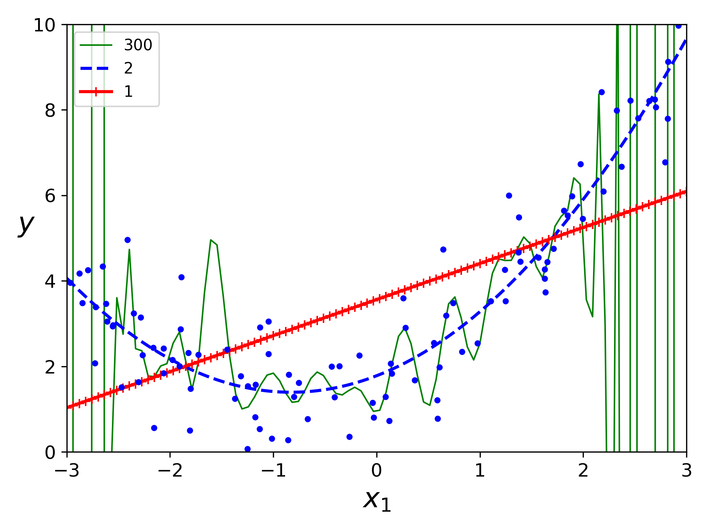<p class="caption">high degree polynomials plot</p>

高阶多项式回归模型严重过拟合训练数据，而线性模型欠拟合，二次模型最能泛化数据集（数据就是使用二次模型生成的）；

**评估模型泛化性能的方法**

- `交叉验证`
  - 若模型在训练数据上表现良好，但交叉验证的指标泛化性能较差，则模型过拟合；
  - 若模型在训练数据和交叉验证表现都较差，则说明欠拟合；
- `学习曲线`：绘制模型在训练集和验证集上关于训练集大小（或训练迭代）的性能函数；在不同大小的训练子集上多次训练模型，观察期分别在训练集和验证集上的性能表现；

**学习曲线函数**

```python
from sklearn.metrics import mean_squared_error
from sklearn.model_selection import train_test_split


def plot_learning_curves(model, X, y):
    X_train, X_val, y_train, y_val = train_test_split(
        X, y, test_size=0.2, random_state=10)
    train_errors, val_errors = [], []
    for m in range(1, len(X_train) + 1):
        model.fit(X_train[:m], y_train[:m])
        y_train_predict = model.predict(X_train[:m])
        y_val_predict = model.predict(X_val)
        train_errors.append(mean_squared_error(y_train[:m], y_train_predict))
        val_errors.append(mean_squared_error(y_val, y_val_predict))

    plt.plot(np.sqrt(train_errors), "r-+", linewidth=2, label="train")
    plt.plot(np.sqrt(val_errors), "b-", linewidth=3, label="val")
    plt.legend(loc="upper right", fontsize=14)
    plt.xlabel("Training set size", fontsize=14)
    plt.ylabel("RMSE", fontsize=14)
```

分别截取前 1、2、... m 个实例作为训练集进行训练，绘制其训练集和测试集上的性能效果；

**普通线性回归模型的学习曲线**

```python
lin_reg = LinearRegression()
plot_learning_curves(lin_reg, X, y)
plt.axis([0, 80, 0, 3])
plt.show()
```

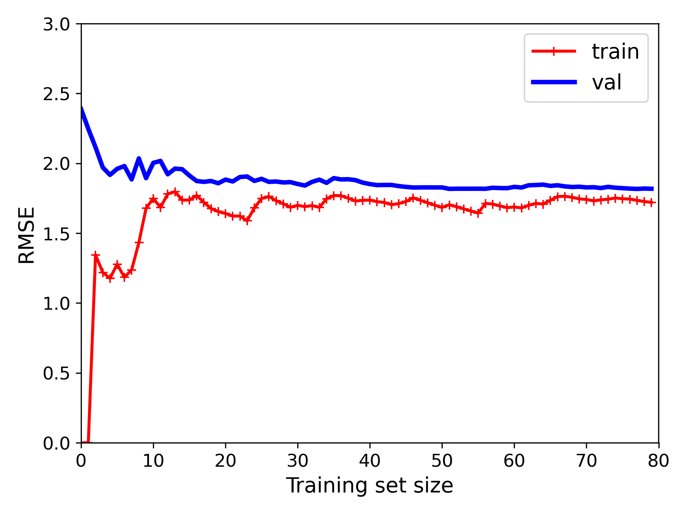<p class="caption">underfitting learning curves plot</p>

当训练集只有一个或两个实例时，模型可以很好的拟合训练集（ train 曲线的 RMSE 从零开始），但无法正确泛化验证集（val 曲线误差很大）；随着新实例的加入，模型不能完美拟合训练数据（数据有噪声，且并非线性），但随着不断学习，验证集误差逐渐降低，训练集误差会一直上升，直到达到平稳状态；两条曲线最终接近，但误差停留在较高的位置；这说明模型是欠拟合训练集，且添加更多训练实例也无济于事，可能需要更复杂的模型或提供更好的特征；

**10 阶多项式模型的学习曲线**

```python
from sklearn.pipeline import Pipeline

polynomial_regression = Pipeline([
    ("poly_features", PolynomialFeatures(degree=10, include_bias=False)),
    ("lin_reg", LinearRegression()),
])

plot_learning_curves(polynomial_regression, X, y)
plt.axis([0, 80, 0, 3])
plt.show()
```

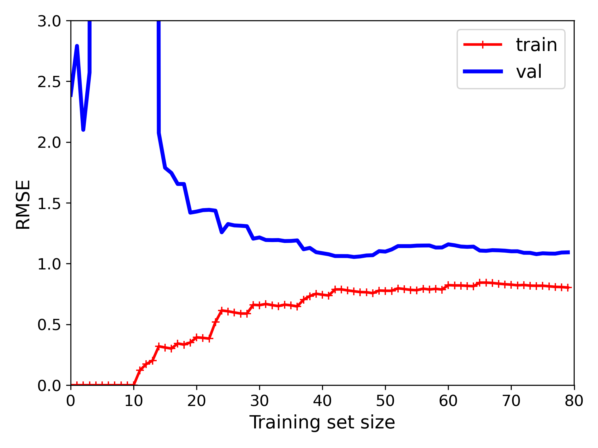<p class="caption">learning curves plot</p>

- 与普通线性回归模型相比，训练数据上的误差低了很多（2 -> 1）；
- train 与 val 曲线之间的间隙更大，说明该模型在训练集上的性能要比在验证集上的性能要好很多，这说明模型过拟合，不过若使用更大的训练集，两条曲线会继续接近；

**偏差与方差的权衡**

统计学和机器学习的事实：模型的泛化误差可以表示为`偏差`、`方差`、`不可避免的误差`这三个非常不同的误差之和；

- `偏差`，错误的假设，如假设数据是线性的，而实际是二次的；高偏差模型可能欠拟合训练数据；
- `方差`，模型对训练数据的细微变化过于敏感，自由度越高可能方差越大，如高阶多项式模型，因此可能过拟合训练数据；
- `不可避免的误差`，数据本身的噪声，减少该误差的办法唯有清理数据（如修复数据源、检查并移除异常值等）；

增加模型复杂度通查会显著提升模型的方差并减少偏差，反之降低模型复杂度则会提升模型的偏差并降低方差，这其中需要试具体应用场景来权衡；

## 5. 正则化线性模型

- `正则化`，即约束模型，线性模型通常通过约束模型的权重来实现；一种简单的方法是减少多项式的次数；模型拥有的自由度越小，则过拟合数据的难度就越大；

### 1. 岭回归

- `岭回归`，也称 Tikhonov 正则化，线性回归的正则化版本，将等于 $\alpha \sum_{i=1}^{n}\theta_i^2$ 的正则化项添加到成本函数；迫使学习算法拟合数据，使模型权重尽可能小；

仅在训练期间将正则化项添加到成本函数中，训练完模型后，使用非正则化的性能度量来评估模型的性能；好的训练成本函数应该具有对优化友好的导数，而用于测试的性能指标应该尽可能的接近最终目标（如使用成本函数如对数损失来训练分类器，但使用精度/召回率对其进行评估）；

**岭回归的成本函数**

$$
    J(\theta) = MSE(\theta) + \alpha \frac{1}{2} \sum_{i=1}^{n} \theta_i^2
$$

- $\alpha$，控制要对模型进行正则化的程度的超参数，若 $\alpha$ = 0，则岭回归仅是一个线性回归，若 $\alpha$ 非常大，则所有权重最终都非常接近于零，结果是一条经过数据均值的平线；
- $\theta_i$ 从 $\theta_1$ 开始，偏置项 $\theta_0$ 没有进行正则化；

若定义 w 为特征权重的向量（$\theta_1$ 至 $\theta_n$），则正则项等于 $\frac{1}{2}(\lVert w\lVert_2)^2$，其中 $\lVert w\lVert_2$ 表示权重向量的 $\ell_2$ 范数；

岭回归对输入特征的缩放敏感，因此知悉岭回归之前需要缩放数据（如使用 StandardScaler）；

**不同 $\alpha$ 值对线性数据训练的几种岭回归模型**

```python
>>> np.random.seed(42)
>>> m = 20
>>> X = 3 * np.random.rand(m, 1)
>>> y = 1 + 0.5 * X + np.random.randn(m, 1) / 1.5
>>> X_new = np.linspace(0, 3, 100).reshape(100, 1)
```

使用 AndreLouis Cholesky 矩阵分解技术，执行岭回归（闭式解）；

```python
>>> from sklearn.linear_model import Ridge
>>> ridge_reg = Ridge(alpha=1, solver="cholesky", random_state=42)
>>> ridge_reg.fit(X, y)
>>> ridge_reg.predict([[1.5]])
array([[1.55071465]])
```

```python
>>> ridge_reg = Ridge(alpha=1, solver="sag", random_state=42)
>>> ridge_reg.fit(X, y)
>>> ridge_reg.predict([[1.5]])
array([[1.55072189]])
```

```python
from sklearn.linear_model import Ridge


def plot_model(model_class, polynomial, alphas, **model_kargs):
    for alpha, style in zip(alphas, ("b-", "g--", "r:")):
        model = model_class(
            alpha, **model_kargs) if alpha > 0 else LinearRegression()
        if polynomial:
            model = Pipeline([
                ("poly_features", PolynomialFeatures(
                    degree=10, include_bias=False)),
                ("std_scaler", StandardScaler()),
                ("regul_reg", model),
            ])
        model.fit(X, y)
        y_new_regul = model.predict(X_new)
        lw = 2 if alpha > 0 else 1
        plt.plot(X_new, y_new_regul, style, linewidth=lw,
                 label=r"$\alpha = {}$".format(alpha))
    plt.plot(X, y, "b.", linewidth=3)
    plt.legend(loc="upper left", fontsize=15)
    plt.xlabel("$x_1$", fontsize=18)
    plt.axis([0, 3, 0, 4])


plt.figure(figsize=(8, 4))
plt.subplot(121)
plot_model(Ridge, polynomial=False, alphas=(0, 10, 100), random_state=42)
plt.ylabel("$y$", rotation=0, fontsize=18)
plt.subplot(122)
plot_model(Ridge, polynomial=True, alphas=(0, 10**-5, 1), random_state=42)
plt.show()
```

- 左：普通岭模型，线性预测；
- 右：带有岭正则化的多项式回归；使用 PolynomialFeatures(degree=10) 扩展数据，使用 StandardScaler 进行缩放，最后将岭模型应用于结果特征；

随着 $\alpha$ 的增加，预测更平坦（不极端、更合理），模型的方差减少，偏差增加；

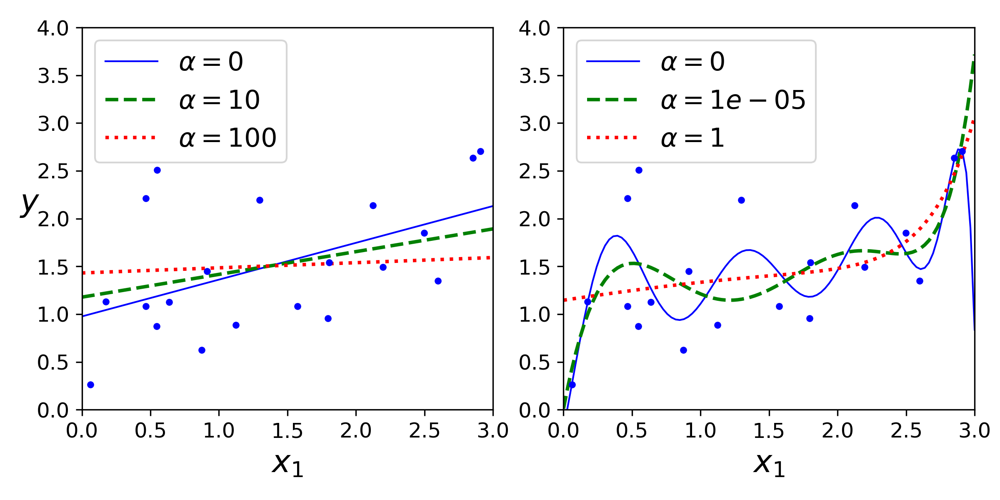<p class="caption">ridge regression plot</p>

**闭式解的岭回归**

$$
    \hat{\theta} = (X^T X=\alpha A)^{-1}X^T y
$$

- A 是 $(n+1) \times (n+1)$ 单位矩阵；

**使用随机梯度下降**

```python
>>> sgd_reg = SGDRegressor(penalty="l2")
>>> sgd_reg.fit(X, y.ravel())
>>> sgd_reg.predict([[1.5]])
array([1.47012588])
```

超参数 penalty 设置的是使用正则项的类型，12 表示希望 SGD 在成本函数中添加一个正则项，等于权重向量的 $\ell_2$ 范数的平方的一半，即岭回归；

### 2. Lasso 回归

- `Lasso 回归`，最小绝对收缩和选择算子回归（Least Absolute Shrinkage and Selection Operator Regression，简称 Lasso 回归），向成本函数添加一个正则项（权重向量的 $\ell_1$ 范数）；

**Lasso 回归成本函数**

$$
    J(\theta) = MSE(\theta) + \alpha \sum_{i=1}^{n} \lvert \theta_i \lvert
$$

**使用不同级别的 Lasso 正则化**

```python
from sklearn.linear_model import Lasso

plt.figure(figsize=(8, 4))
plt.subplot(121)
plot_model(Lasso, polynomial=False, alphas=(0, 0.1, 1), random_state=42)
plt.ylabel("$y$", rotation=0, fontsize=18)
plt.subplot(122)
plot_model(Lasso, polynomial=True, alphas=(0, 10**-7, 1), random_state=42)

plt.show()
```

<p class="caption">lasso regression plot</p>

Lasso 回归倾向于完全消除掉最不重要的特征的权重；（$\alpha = 10^{-7}$ 看起来像二次的，因为所有高阶多项式的特征权重都等于零）；Lasso 回归会自动执行特征选择并输出一个稀疏模型（只有很少的特征有非零权重）；

Lasso 成本函数在 $ \theta = 0 $ 处是不可微的，可以使用子梯度向量 g 代替任何 $\theta_i = 0$;

**带有 Lasso 成本函数的梯度下降的子梯度向量方程**

$$
    g(\theta, J) = \nabla_{\theta} MSE(\theta) + \alpha \begin{pmatrix}
        sin(\theta_1) \\
        sin(\theta_2) \\
        ... \\
        sin(\theta_n)
    \end{pmatrix}, sin(\theta_i) = \begin{cases}
     -1 \; if \theta_i < 0 \\
     0 \; if \theta_i = 0 \\
     +1 \; if \theta_i > 0
   \end{cases}
$$

### 3. 弹性网络

- `弹性网络`，介于岭回归和 Lasso 回归之间的中间地带，正则项式岭和 Lasso 正则项的简单混合，通过 r 控制混合比；r=0 时，弹性网络等效于岭回归，r=1 时，弹性网络等效于 Lasso 回归；

**弹性网络成本函数**

$$
    J(\theta) = MSE(\theta) + r\alpha \sum_{i=1}^{n} \lvert \theta_i \lvert + \frac{1-r}{2} \alpha \sum_{i=1}^{n} \theta_i^2
$$

- 通常有正则化比没有更可取，大多数情况下应避免纯线性回归；此时岭回归是不错的默认选择；
- 当实际用到的特征只有少数几个，可以考虑 Lasso 回归或弹性网络，它们会将无用特征的权重降为零；
- 弹性网络一半由于 Lasso 回归，特征数据超过实例数量，或者几个特征强相关时，Lasso 回归表现可能很不稳定；

**ElasticNet 示例**

```python
>>> from sklearn.linear_model import ElasticNet
>>> elastic_net = ElasticNet(alpha=0.1, l1_ratio=0.5, random_state=42)
>>> elastic_net.fit(X, y)
>>> elastic_net.predict([[1.5]])
array([1.54333232])
```

### 4. 提前停止

- `提前停止`，对于梯度下降这类迭代学习算法，在验证误差达到最小值时停止训练；通过早期停止法，一旦验证误差达到最小值就立刻停止训练；

<p class="caption">early stopping plot</p>

随机和小批量梯度下降时，曲线不是平滑的，可能很难知道是否达到最小值，此时可以仅在验证错误超过最小值一段时间后停止（确信模型不会做到更好时），然后回滚模型参数到验证误差最小的位置；

**提前停止法示例**

```python
np.random.seed(42)
m = 100
X = 6 * np.random.rand(m, 1) - 3
y = 2 + X + 0.5 * X**2 + np.random.randn(m, 1)

X_train, X_val, y_train, y_val = train_test_split(
    X[:50], y[:50].ravel(), test_size=0.5, random_state=10)
```

```python
from copy import deepcopy

poly_scaler = Pipeline([
    ("poly_features", PolynomialFeatures(degree=90, include_bias=False)),
    ("std_scaler", StandardScaler())
])

X_train_poly_scaled = poly_scaler.fit_transform(X_train)
X_val_poly_scaled = poly_scaler.transform(X_val)

sgd_reg = SGDRegressor(max_iter=1, warm_start=True, penalty=None,
                       learning_rate="constant", eta0=0.0005, random_state=42)

minimum_val_error = float("inf")
best_epoch = None
best_model = None
for epoch in range(1000):
    sgd_reg.fit(X_train_poly_scaled, y_train)  # continues where it left off
    y_val_predict = sgd_reg.predict(X_val_poly_scaled)
    val_error = mean_squared_error(y_val, y_val_predict)
    if val_error < minimum_val_error:
        minimum_val_error = val_error
        best_epoch = epoch
        best_model = deepcopy(sgd_reg)
```

warm_start=True 表示调用 fit() 方法时，在停止的地方继续训练，而不是从头开始；

## 6. 逻辑回归

- `逻辑回归`，Logistic 回归，Logit 回归，广泛应用于估算一个示例属于某个特定类别的概率；（二元分类器：预估概率高于 50% 则模型预测该实例属于该类别，称正类，反之则预测不是该类别，称负类）；

### 1. 估计概率

逻辑回归模型也是计算输入特征的加权和（加上偏置项），但不同于线性回归模型直接输出结果，它输出的是梳理逻辑值；

**逻辑回归模型的估计概率（向量化形式）**

$$
    \hat{p} = h_\theta(x) = \sigma(x^T\theta)
$$

**逻辑函数**

$$
    \sigma(t) = \frac{1}{1+exp(-t)}
$$

分数 t 称为 logit，估计概率 p 的对上；logit(p) = log(p/(1-p))，与 logistic 函数相反；
对数也称对数奇数，是正类的估计概率与父类的估计概率之比的对数；

```python
t = np.linspace(-10, 10, 100)
sig = 1 / (1 + np.exp(-t))
plt.figure(figsize=(9, 3))
plt.plot([-10, 10], [0, 0], "k-")
plt.plot([-10, 10], [0.5, 0.5], "k:")
plt.plot([-10, 10], [1, 1], "k:")
plt.plot([0, 0], [-1.1, 1.1], "k-")
plt.plot(t, sig, "b-", linewidth=2, label=r"$\sigma(t) = \frac{1}{1 + e^{-t}}$")
plt.xlabel("t")
plt.legend(loc="upper left", fontsize=20)
plt.axis([-10, 10, -0.1, 1.1])
plt.show()
```

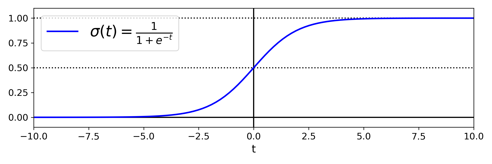<p class="caption">logistic function plot</p>

逻辑回归模型估算出实例 x 属于整理的概率 $\hat{p} = h_\theta(x)$，就可以预测 $\hat{y}$

**逻辑回归模型预测**

$$
    \hat{y} = \begin{cases}
     0, if \hat{p} < 0.5 \\
     1, if \hat{p} \geq 0.5
   \end{cases}
$$

当 $t < 0$ 时，$\sigma(t) < 0.5$；当 $t \geq 0$ 时，$\sigma(t) \geq 0.5$；因此若 $X^T\theta$ 是正类，逻辑回归模型预测结果就是 1，若是负类，则预测结果为 0；

### 2. 训练和成本函数

训练的目的是设置参数向量 $\theta$，是模型对正类实例做出高概率估算，对负类实例做出低概率估算；

**单个训练实例的成本函数**

$$
    c(\theta) = \begin{cases}
     -log(\hat{p}), if y=1 \\
     -log(1-\hat{p}), if y=0
   \end{cases}
$$

当 t 接近 0 时，-log(t) 会变得非常大，若模型估算一个正类实例的概率接近与 0，成本降变得很高；负类实例同理；对一个负类实例估算概率接近 0，对一个正类实例估算概率接近与 1，而成本则都解决与 0，这正式我们想要的；

**逻辑回归成本函数（对数损失）**

整个训练集的成本函数是所有训练实例的平均成本，可以用一个对数损失单一表达式表示；

$$
    J(\theta) = -\frac{1}{m} \sum_{i=1}^{m}[y^{i} log(\hat{p}^i) + (1-y^{(i)})log(1 - \hat{p}^{(i)})]
$$

该函数没有已知的闭式方程（不存在一个标准方程的等价方程）来计算出最小化成本函数的 $\theta$ 值；但这是一个凸函数，通过梯度下降等任意优化算法可以找出全局最小值（学习率不太高、运行足够长时间的情况下）；

**逻辑成本函数偏导数**

$$
    \frac{\partial}{\partial\theta_j} J(\theta) = \frac{1}{m} \sum_{i=1}^{m} (\sigma (\theta^Tx^{(i)}) - y^{(i)}) x_j^{(i)}
$$

对每个实例计算预测误差并将其乘以第 j 个特征值，然后计算所有训练实例的平均值；有了包含所有偏导数的梯度向量，就可以使用梯度下降算法；

### 3. 决策边界

**基于花瓣宽度特征，创建一个分类器检测维吉尼亚鸢尾花**

```python
>>> from sklearn import datasets
>>> iris = datasets.load_iris()
>>> list(iris.keys())
['data',
 'target',
 'frame',
 'target_names',
 'DESCR',
 'feature_names',
 'filename',
 'data_module']

>>> print(iris.DESCR)
.. _iris_dataset:

Iris plants dataset
--------------------

**Data Set Characteristics:**

    :Number of Instances: 150 (50 in each of three classes)
    :Number of Attributes: 4 numeric, predictive attributes and the class
    :Attribute Information:
        - sepal length in cm
        - sepal width in cm
        - petal length in cm
        - petal width in cm
        - class:
                - Iris-Setosa
                - Iris-Versicolour
                - Iris-Virginica

    :Summary Statistics:

    ============== ==== ==== ======= ===== ====================
                    Min  Max   Mean    SD   Class Correlation
    ============== ==== ==== ======= ===== ====================
    sepal length:   4.3  7.9   5.84   0.83    0.7826
...
     on Information Theory, May 1972, 431-433.
   - See also: 1988 MLC Proceedings, 54-64.  Cheeseman et al"s AUTOCLASS II
     conceptual clustering system finds 3 classes in the data.
   - Many, many more ...
```

```python
>>> X = iris["data"][:, 3:]  # petal width
>>> y = (iris["target"] == 2).astype(np.int64)  # 1 if Iris virginica, else 0
```

**训练一个逻辑回归模型**

```python
from sklearn.linear_model import LogisticRegression
log_reg = LogisticRegression(solver="lbfgs", random_state=42)
log_reg.fit(X, y)
```

花瓣宽度在 0 到 3cm 之间的鸢尾花，模型估算出的概率如下；

```python
X_new = np.linspace(0, 3, 1000).reshape(-1, 1)
y_proba = log_reg.predict_proba(X_new)
decision_boundary = X_new[y_proba[:, 1] >= 0.5][0][0]

plt.figure(figsize=(8, 3))
plt.plot(X[y==0], y[y==0], "bs")
plt.plot(X[y==1], y[y==1], "g^")
plt.plot([decision_boundary, decision_boundary], [-1, 2], "k:", linewidth=2)
plt.plot(X_new, y_proba[:, 1], "g-", linewidth=2, label="Iris virginica")
plt.plot(X_new, y_proba[:, 0], "b--", linewidth=2, label="Not Iris virginica")
plt.text(decision_boundary+0.02, 0.15, "Decision  boundary", fontsize=14, color="k", ha="center")
plt.arrow(decision_boundary, 0.08, -0.3, 0, head_width=0.05, head_length=0.1, fc='b', ec='b')
plt.arrow(decision_boundary, 0.92, 0.3, 0, head_width=0.05, head_length=0.1, fc='g', ec='g')
plt.xlabel("Petal width (cm)", fontsize=14)
plt.ylabel("Probability", fontsize=14)
plt.legend(loc="center left", fontsize=14)
plt.axis([0, 3, -0.02, 1.02])
plt.show()
```

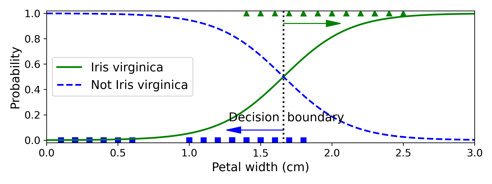<p class="caption">logistic regression plot</p>

维吉尼亚鸢尾花（三角形）的花瓣宽度范围为 1.4 ~ 2.5 cm，其他两种鸢尾花（正方形）花瓣宽度范围为 0.1 ~ 1.8 cm，存在一部分重叠；

花瓣宽度超过 2cm 的花和低于 1cm 的花可以很明确其分别对应维吉尼亚鸢尾花和非维吉尼亚鸢尾花（对正类和负类输出了高概率值），而两个极端中间部分不太好把握，只能返回一个可能性最大的类别，概率相等处表示正类和父类的可能性都是 50%，这就是一个`决策边界`；

**基于花瓣宽度和花瓣长度两个特征，创建一个分类器检测维吉尼亚鸢尾花**

```python
from sklearn.linear_model import LogisticRegression

X = iris["data"][:, (2, 3)]  # petal length, petal width
y = (iris["target"] == 2).astype(np.int64)

log_reg = LogisticRegression(solver="lbfgs", C=10**10, random_state=42)
log_reg.fit(X, y)

x0, x1 = np.meshgrid(
    np.linspace(2.9, 7, 500).reshape(-1, 1),
    np.linspace(0.8, 2.7, 200).reshape(-1, 1),
)
X_new = np.c_[x0.ravel(), x1.ravel()]

y_proba = log_reg.predict_proba(X_new)

plt.figure(figsize=(10, 4))
plt.plot(X[y == 0, 0], X[y == 0, 1], "bs")
plt.plot(X[y == 1, 0], X[y == 1, 1], "g^")

zz = y_proba[:, 1].reshape(x0.shape)
contour = plt.contour(x0, x1, zz, cmap=plt.cm.brg)


left_right = np.array([2.9, 7])
boundary = -(log_reg.coef_[0][0] * left_right +
             log_reg.intercept_[0]) / log_reg.coef_[0][1]

plt.clabel(contour, inline=1, fontsize=12)
plt.plot(left_right, boundary, "k--", linewidth=3)
plt.text(3.5, 1.5, "Not Iris virginica", fontsize=14, color="b", ha="center")
plt.text(6.5, 2.3, "Iris virginica", fontsize=14, color="g", ha="center")
plt.xlabel("Petal length", fontsize=14)
plt.ylabel("Petal width", fontsize=14)
plt.axis([2.9, 7, 0.8, 2.7])
plt.show()
```

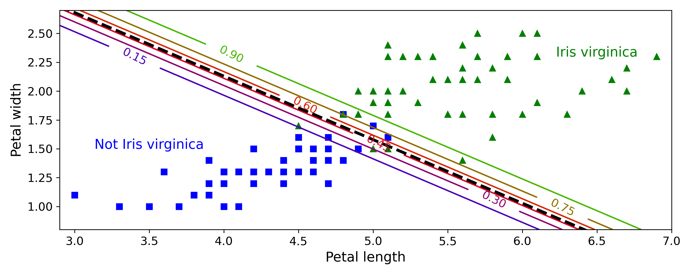<p class="caption">logistic regression contour plot</p>

虚线表示模型估算概率为 50% 的点，即模型的决策边界（线性的边界，每条平行线代表一个模型输出的特定概率）；

- 逻辑回归模型可以用 $\ell_1$ 或 $\ell_2$ 惩罚函数来正则化，Scikit-Learn 默认添加 $\ell_2$ 函数；
- C，Scikit-Learn LogisticRegression 模型的正则化强度超参数，$\alpha$ 的反值，C 值越高，对模型的正则化越少；

### 4. Softmax 回归

Softmax 回归，又叫多元逻辑回归，逻辑回归模型的推广，可以直接支持多个类别（每次只能预测一个类，即多类而非多输出，只能与互斥的类一起使用），而不需训练并组合多个二元分类器；

**类 k 的 Softmax 分数**

$$
    S_k(x) = x^T\theta^{(k)}
$$

给定一个实例 x，Softmax 回归模型先计算出每个类 k 的分数 $S_k(x)$，然后对这些分数应用 softmax 函数（归一化指数）估算出每个类的概率；

每个类有自己的特定参数向量 $\theta^{k}$，所有这些向量通常作为行存储在参数矩阵 $\Theta$；

**Softmax 函数**

$$
    \hat{p}_k = \sigma(s(x))_k = \frac{exp(s_k(x))}{\sum_{j=1}^{K} exp(s_j(x))}
$$

- K，类数；
- s(x)，一个向量，包含实例 x 的每个类的分数；
- $\sigma(s(x))_k$，实例 x 属于类 k 的估计概率，给定该实例每个类的分数；

**Softmax 回归分类预测**

$$
    \hat{y} = argmax_k \; \sigma(s(x))_k = argmax_k \; s_k(x) = argmax_k((\theta^{(k)})^Tx)
$$

argmax 运算符返回使函数最大化的变量值；此处返回使估计概率 $\sigma(s(x))_k$ 最大化的 k 值；

**交叉熵成本函数**

通常用于衡量一组估算出的类概率跟目标类的匹配程度；

$$
    J(\Theta) = - \frac{1}{m} \sum_{i=1}^{m} \sum_{k=1}^{K} y_k^{(i)} log(\hat{p}_k^{(i)})
$$

- $y_k^{(i)}$，属于类 k 的第 i 个实例的目标概率，一般为 1 或 0，表示实例是否属于该类；

当只有两个类（K=2）时，此成本函数等效于逻辑回归的成本函数（对数损失）；

**类 k 的交叉熵梯度向量**

成本函数相对于 $\theta^{(k)}$ 的梯度向量；计算每个类的梯度向量，然后使用梯度下降（或其他任意优化算法）找到最小化成本函数的参数矩阵 $\Theta$；

$$
    \nabla_{\theta(k)}J(\Theta) = \frac{1}{m} \sum_{i=1}^{m} (\hat{p}_k^{(i)} - y_k^{(i)}) x^{(i)}
$$

**使用 Softmax 回归将鸢尾花分为三类**

```python
X = iris["data"][:, (2, 3)]  # petal length, petal width
y = iris["target"]

softmax_reg = LogisticRegression(multi_class="multinomial", solver="lbfgs", C=10, random_state=42)
softmax_reg.fit(X, y)
```

- LogisticRegressio 默认使用一对多的训练方式，设置超参数 multi_class 为 multinomial 可以切换为 Softmax 回归；
- `solver="lbfgs"`，指定支持 Softmax 回归的求解器；
- `C`，正则化超参数，默认使用 $\ell_2$ 正则化;

```python
from matplotlib.colors import ListedColormap
x0, x1 = np.meshgrid(
    np.linspace(0, 8, 500).reshape(-1, 1),
    np.linspace(0, 3.5, 200).reshape(-1, 1),
)
X_new = np.c_[x0.ravel(), x1.ravel()]


y_proba = softmax_reg.predict_proba(X_new)
y_predict = softmax_reg.predict(X_new)

zz1 = y_proba[:, 1].reshape(x0.shape)
zz = y_predict.reshape(x0.shape)

plt.figure(figsize=(10, 4))
plt.plot(X[y == 2, 0], X[y == 2, 1], "g^", label="Iris virginica")
plt.plot(X[y == 1, 0], X[y == 1, 1], "bs", label="Iris versicolor")
plt.plot(X[y == 0, 0], X[y == 0, 1], "yo", label="Iris setosa")

custom_cmap = ListedColormap(['#fafab0', '#9898ff', '#a0faa0'])

plt.contourf(x0, x1, zz, cmap=custom_cmap)
contour = plt.contour(x0, x1, zz1, cmap=plt.cm.brg)
plt.clabel(contour, inline=1, fontsize=12)
plt.xlabel("Petal length", fontsize=14)
plt.ylabel("Petal width", fontsize=14)
plt.legend(loc="center left", fontsize=14)
plt.axis([0, 7, 0, 3.5])
plt.show()
```

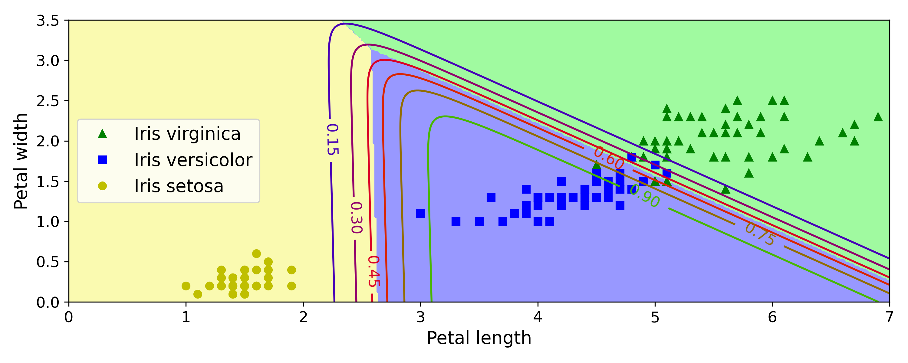<p class="caption">softmax regression contour plot</p>

任何两个类之间的决策边界都是线性的，估算概率可能是低于 50% 的，在所有决策边界相交的地方，所有类的估算概率都为 33%；

```python
>>> softmax_reg.predict([[5, 2]])
array([2])

>>> softmax_reg.predict_proba([[5, 2]])
array([[6.38014896e-07, 5.74929995e-02, 9.42506362e-01]])
```

花瓣长 5cm，宽 2cm，模型预测结果为 94.2% 是维吉尼亚鸢尾，5.8% 是变色鸢尾；

---

**欢迎各路道友`阅读`与`评论`，感谢道友`点赞`、`关注`、`收藏`！**

---

**参考资料：**

- [1]《机器学习》
- [2]《机器学习实战》
