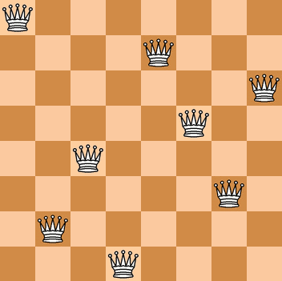

**递归：计算思维的核心**

> Prompt: 简单介绍一下计算思维的核心：栈式调用与递归
>
> Prompt: 关于递归，你想说些什么？
>
> Prompt: 对比一下递归与递推
>
> Prompt: 分别从如下场景给出 Python 示例和分析：
> 数学问题： 计算阶乘、斐波那契数列等。
> 数据结构： 遍历树、图等递归结构。
> 分治算法： 快速排序、归并排序等。
>
> Prompt: 分析八皇后问题的递归求解思路，并使用 Python 给出最佳实现：
>
> 八皇后问题：在 8×8 的国际象棋棋盘上摆放 8 个皇后，使得任意两个皇后都不能在同一行、同一列或同一斜线上。问有多少种摆法？

# 引言

人类对这个世界的认识是从特例到普遍，从具体到抽象，从简单到复杂的，是一个`递推`（`Iterative`）的过程。这种人类固有的认知与思维方式令我们可以轻易的理解具体的事物，但同时却限制了我们的`抽象能力`和`大局观`。

而计算机执行任务的方式（可以称之为`“计算思维”`）与人类正好相反，是自顶向下，由全局到局部的，往往是一个`递归`（`Recursive`）的过程，是人为的进行了抽象设计的。递归是计算思维中的核心概念，通过递归，将复杂的计算问题分解为更小的子问题，然后计算机从全局进入到局部，一步步迭代执行简化的子问题，最终求得整个问题的解。

可见，若将人类普遍的思维方式当做正向的思维，那么计算机的“处事方式”则往往采取了“逆向思维”！

# 递归思想

递归是一种强大且优雅的解决问题的方法。它以简洁的方式处理复杂问题，尤其适用于具有重复性质的问题。

试想一下求解 $5!$ 的方式，如果按照正向思维，我们可以通过 $5 \times 4 \times 3 \times 2 \times 1$ 来求解。其 Python 代码如下：

```python
def factorial(n):
    result = 1
    for i in range(1, n+1):
        result *= i
    return result
```

而如果使用递归思想，我们可以将 $5!$ 分解为 $5 \times 4!$，然后再将 $4!$ 分解为 $4 \times 3!$，以此类推，直到 $1!$ 为止。Python 代码如下：

```python
def factorial(n):
    if n == 0:
        return 1
    else:
        return n * factorial(n-1)
```

通过上述递归求解 $5!$ 的方式，我们可以了解递归求解问题的两个关键要素：

- `基本情况`(`Base Case`)，不再递归的条件，即最初始的、简单的、可以直接得出结果的情况。比如阶乘里的 $1! = 1$。
- `递归情况`(`Recursive Case`)，即当问题每一步变更符合固定规律时，可以根据前后两步的固定的关系基于前一步的解求得当前迭代轮次的解，递归就是基于这个关系从后往前计算的过程。比如阶乘里的 $n!$ = $n \times (n-1)!$。

递归的本质就是调用自身。在阶乘的例子中，它在逻辑上更接近自然的数学定义，更符合问题的自然分治结构。递归调用将问题拆解成更小的子问题，并在达到递归基条件时终止递归。

# 递归历险

通过求解 $5!$ 这样简单的问题我们可能还无法感受到递归的妙处，下面我们以复杂一些的示例来展示递归思想的优势。

## 抢 20 游戏

> 两个人做游戏，轮流从 1 和 2 中挑选一个数字，并计算所有被选到数字的总和，当数字的总和正好为 20 时，当前出手的人获胜。问题是如何设定策略可以保证一定能赢？

这个问题正向思维的解法是通过穷举所有可能的情况，然后找到必胜策略，但要穷举所有情况是相当困难的。但是如果采用递归思维，将这个问题分解一下，问题可能会变得相当简单。

我们试想一下，如果想要保证最后一轮轮到自己时，一定能使数字的总和为 20，那么在上一轮轮到自己时数字的总和一定要是 17，因为只有在 17 的基础上，我们可以保障无论对手选择 1 还是 2，我们都可以使数字的总和为 20。

同理，要保障自己可以得到总和为 17 的结果，那么在上上轮轮到自己时数字的总和一定要是 14；以此类推，我们可以得到一个规律，即在轮到自己时，数字的总和一定要是 20 的倍数减去 3 的倍数。最终我们可以得出，只要我们能先抢到 $2 + 3 \times n$ 的总和数，我们就一定能赢，比如我们首轮首次出手就抢到 2。

这就是递归思维的妙处，通过分析问题的结构，我们可以找到问题的关键规律，比如只要在上一轮我们抢到了比最终总和 20 差 3 的总和数，就能赢得游戏。在此基础上可以将整个问题拆解成简单的子问题，如保障每一轮都能得到比上一轮总和差 3 的总和数，就一定能赢得游戏。如此，我们只需要关注并依次解决当前简单的子问题，直到迭代达到递归基条件时终止，如只要保障最初可以抢到 2 就一定能赢。问题就这样被神奇的解决了。

递归思维的解法是通过分析问题的结构，找到问题每一步变动时的规律，如果这个变动是一个固定关系，那么可以假设我们已经拿到前一步的解，基于这个固定关系和前一步的解，我们就能够计算出下一步的解，如此从后往前递归迭代，直到遇到初始的状态。

## 上台阶问题

> 总共有 20 个台阶，每次可以上 1 或者 2 个台阶，那么总共有多少种上到 20 阶的方式？

与“抢 20 游戏”类似，我们求解这个问题的正向思路就是将所有的可能性统统列举出来，比如（1、4、7、10、12、15、18、20），（1、2、5、8、11、14、17、20）等等，然后试图从中找到一般性规律，从而找到第 n 阶的做法数与 n 的关系（$F(n)$）。但这无疑是非常困难的，我们看看 F(n) 的公式就知道这有多难：

$$
    F(n) = \frac{1}{\sqrt{5}}[(\frac{1+\sqrt{5}}{2})^n - (\frac{1-\sqrt{5}}{2})^n]
$$

但是如果我们换个思路，采用逆向思维，问题就会变得很简单。我们只要知道，当前所处的台阶位置只能是从低它 1 阶或 2 阶这两种情况而来，比如第 20 阶只能是从第 19 阶或第 18 阶而来，那么自然而然的就可以得出 F(20) 其实就是 F(19) 与 F(18) 的和，更一般的：

$$
    F(n) = F(n-1) + F(n-2)
$$

我们不难知道 F(1) = 1，F(2) = 2，因此采用递归方法很容易实现求解：

```python
def climb_stairs(n):
    if n == 1:
        return 1
    if n == 2:
        return 2
    return climb_stairs(n-1) + climb_stairs(n-2)
```

## 汉诺塔问题

> 有三根杆子 A、B、C。A 杆上有 N 个 (N > 1) 穿孔圆盘，盘的尺寸由下到上依次变小。要求按下列规则将所有圆盘移至 C 杆：
>
> 1. 每次只能移动一个圆盘；
> 2. 大盘不能叠在小盘上面；
> 3. B 可以临时作为中转。

这个问题的解法是一个典型的递归问题，我们可以将其分解为三个子问题：

1. 将 n-1 个盘子从 A 经过 C 移到 B；
2. 将第 n 个盘子从 A 移到 C；
3. 将 n-1 个盘子从 B 经过 A 移到 C。

如此我们不难实现圆盘的移动解法：

```python
def hanoi(n, A, B, C):
    if n == 1:
        print(f"Move disk {n} from {A} to {C}") # 当只需要移动 1 个盘子时，直接将它从 A 移到 C；
    else:
        hanoi(n-1, A, C, B)                     # 将 n-1 个盘子从 A 经过 C 移到 B；
        print(f"Move disk {n} from {A} to {C}") # 将第 n 个盘子从 A 移到 C；
        hanoi(n-1, B, A, C)                     # 将 n-1 个盘子从 B 经过 A 移到 C；
```

若是依旧采用正向思维，我们可能会陷入无尽的穷举中，但是递归思维却能够很好的解决这个问题，通过分析问题的结构，我们可以找到问题的关键规律，比如只要将 n-1 个盘子从 A 经过 C 移到 B，然后将第 n 个盘子从 A 移到 C，最后将 n-1 个盘子从 B 经过 A 移到 C，就轻易地解决了整个问题。

## 八皇后问题

> 在 8×8 的国际象棋棋盘上摆放 8 个皇后，使得任意两个皇后都不能在同一行、同一列或同一斜线上。问有多少种摆法？



同样采用递归思路求解，我们采用逐行放置皇后的方式，并判断当前放置是否安全。如果安全，则递归地继续放置下一行的皇后；如果不安全，则回溯，移除当前已放置的皇后，尝试下一个位置。

求解思路如下：

1. 使用一个一维数组 queens，其中 queens[i] 表示第 i 行放置皇后的列编号；
2. 定义一个递归函数 place_queen(row)，表示在第 row 行放置皇后；
3. 在 place_queen(row) 中，尝试在第 row 行的每一列放置皇后，如果放置的位置安全（不与前面的皇后冲突），则递归调用 place_queen(row + 1)；
4. 基准条件是当 row 达到 8 时，说明所有皇后已成功放置，记录一种解法；
5. 安全检查包括同列检查和对角线检查。

Python 代码如下：

```python
def solve_n_queens(n):
    solutions = []
    queens = [-1] * n

    def is_safe(row, col):
        for i in range(row):
            if queens[i] == col or \
               queens[i] - i == col - row or \
               queens[i] + i == col + row:
                return False
        return True

    def place_queen(row):
        if row == n:
            solutions.append(queens[:])
            return
        for col in range(n):
            if is_safe(row, col):
                queens[row] = col
                place_queen(row + 1)
                queens[row] = -1  # 回溯

    place_queen(0)
    return len(solutions), solutions

# 示例
num_solutions, solutions = solve_n_queens(8)
print(f"共有 {num_solutions} 种摆法。")
for solution in solutions:
    print(solution)
```

其中数组 `queens` 记录了每一行皇后的位置，`queens[i]` 是第 `i` 行皇后的列。安全检查 `is_safe` 检查是否存在同列（列序相同）和对角线上（行列差与行列和相同）的皇后。尝试在当前行的每一列放置皇后，如果放置成功，则递归调用下一行的放置函数，如果下一行无法放置，则回溯，尝试下一列位置，如果所有行都成功放置，则找到一个合法解。

通过这种递归回溯的方法，可以有效地找到八皇后问题的所有解法，这个问题改用穷举的思路是非常困难的，实际上就连大数学家高斯穷其一生也只找到了 76 中解法，而实际包含 92 种解法。

## 二叉树遍历

> 给定一个二叉树，返回它的中序遍历。

```python
class TreeNode:
    def __init__(self, val):
        self.val = val
        self.left = None
        self.right = None

def inorder_traversal_recursive(root):
    if root is None:
        return []
    return inorder_traversal_recursive(root.left) + [root.val] + inorder_traversal_recursive(root.right)

# 示例
root = TreeNode(1)
root.right = TreeNode(2)
root.right.left = TreeNode(3)

print(inorder_traversal_recursive(root))
# 输出：[1, 3, 2]
```

递归实现简洁明了，递归正好匹配了树结构的自然递归的特性。

我们可以看一下采用递推思路的实现方式：

```python
def inorder_traversal_iterative(root):
    result, stack = [], []
    while stack or root:
        while root:
            stack.append(root)
            root = root.left
        root = stack.pop()
        result.append(root.val)
        root = root.right
    return result

# 示例
print(inorder_traversal_iterative(root))
# 输出：[1, 3, 2]
```

这里使用了栈模拟递归，性能更高，但代码复杂度明显就增加了。

# 递归 vs. 递推

| 对比   | 递归                                                                                     | 递推                                                             |
| ------ | ---------------------------------------------------------------------------------------- | ---------------------------------------------------------------- |
| 性能   | 递归消耗栈空间，深度过大可能导致栈溢出，需要谨慎处理。                                   | 递推通常更节省内存，因为它只需少量额外的变量来保持状态。         |
| 复杂度 | 递归可能引入重复计算的问题（如斐波那契数列的简单递归），需要优化（如记忆化）来提高效率。 | 递推避免了这些重复计算，通过迭代一步步推进，一般情况下效率更高。 |
| 简洁性 | 递归代码往往更简洁和优雅，对于自相似问题特别有用。                                       | 递推代码在某些情况下可能显得冗长，但通常更直观。                 |
| 自然性 | 对于一些问题，递归是最自然的解决方案，比如树的遍历、汉诺塔问题等。                       |                                                                  |

在一些情况下，递推可能是更高效、更实际的选择，但这并不是说递归就不好，在大多情况下，递归提供了更清晰和自然的解题思路，而一般递归的解法都可以被转换成循环求解的实现方式，这也是为什么我们至少应该掌握递归思想这种计算思维的原因。

# 结语

递归是一种强大且优雅的计算解题思路，它以简洁的方式处理复杂问题，尤其适用于具有一定规律的问题。人们习惯于以归纳总结的方式思考问题，而计算思维恰恰相反。计算机在执行复杂计算任务的过程，天生就是栈式的调用一个个简单计算的递归的过程，想要在计算的世界中达到随心所欲，驾轻就熟的地步，我们要让自己的头脑按照计算机的方式去思考问题。
